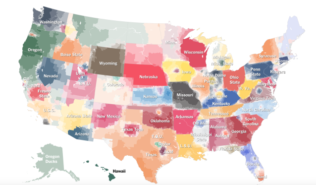
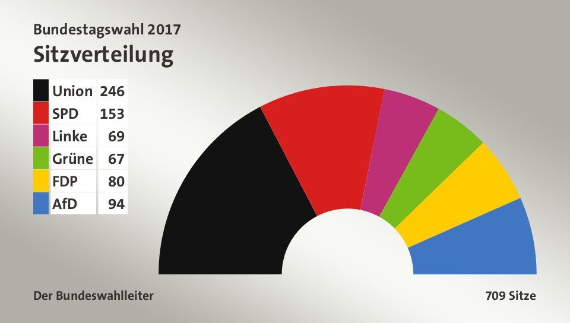
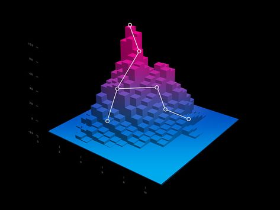

# Einführung in die Datenvisualisierung
**Autors**: Niklas Aßelmann 

---

## Übersicht

- [1 Intro](#1-intro)
- [2 Nutzungsgebiet von Datenvisualisierungen](#2-Nutzungsgebiet-von-Datenvisualisierungen)
  * [2.1 Politik](#21-Politik)
  * [2.2 Naturwissenschaft](#22-Naturwissenschaft)
  * [2.3 Gesundheitswesen](#23-Gesundheitswesen)
  * [2.4 Finanzen](#24-Finanzen)
  * [2.5 Andere](#25-Andere)
- [3 Vor- und Nachteile](#3-Vor- und Nachteile)
  * [3.1 Vorteile](#31-Vorteile)
  * [3.2 Nachteile](#32-Nachteile)
- [4 Regeln](#4-Regeln)
  * [4.1 Regeln für gute Datenvisualisierungen](#42-Regeln-für-gute-Datenvisualisierungen)
  * [4.2 Fehler](#42-Fehler)
- [5 Formen](#4-Formen)
  * [5.1 Indikator](#51-Indikator)
  * [5.1 Balkendiagramm](#51-Balkendiagramm)
  * [5.1 Tortendiagramm](#51-Tortendiagramm)
  * [5.1 Flächendiagramm](#51-Flächendiagramm)
  * [5.1 Scatter Chart](#51-Scatter-Chart)
  * [5.1 Area Map](#51-Area-Map)

---

## 1 Introduction
Was haben diese drei Bilder gemeinsam?
- 
- 
- 
- Die Antwort auf diese Frage ist, dass alle drei Abbildungen Daten visualisieren. 
Aber was genau ist Datenvisualisierung?
- Definiert wird Datenvisualierung als die grafische Darstellung von Informationen und Daten.
- Durch den Einsatz von visuellen Elementen stellt die Datenvisualisierung eine leicht zugängliche Methode dar, um Trends, Ausreißer und Muster in Daten erkennen und verstehen zu können. 

---

## 2 Nutzungsgebiet von Datenvisualisierungen
### 2.1 Politik
- In der Politik werden Wahlergebniss immer als Visualisierung angezeigt um es dem Publikum verstadlich zu machen und es einfachr ist auf z. B. Balkendiagramme zu gucken als auf die "nackten Zahlen"
### 2.2 Naturwissenschaft
- In Zeiten von Big Data gehört die Datenanalyse zu den wohl wichtigsten Beschaftigungen in jeder so gu wie jeder Naturwisenschaft. Ob Mthematik, Informatik oder andere andere Naturwissenschaften, das Analysieren der Daten ist ezzeentiell um die Forschungsergebnisse zu belegen. Diese Ergebniss werden in fast alle Fällen als Visualisierung dargestellt um es auch dem Publikum verständlich zu machen, dass nicht so viel ERfahrung in dem Themenfeld hat.
### 2.3 Gesundheitswesen
- Auch im Gesundheitswesen werden DAtenvisualisierungen genutzt. Zum Beispel die ausbreitung einer Krankheit kann sehr gut auf einer Karte visualisiert werden
#### 2.4 Finanzen
- Auf dem Aktienmarkt wird der Verlauf einer Aktie immer visualisiert um Trends oder Ausreißer zu erkennen.
#### 2.5 Andere
- Datenvisualisierungen sind in fast alle Feldern zu finden, die mit Datenbeschaffung, DAtenanalyse oder Datenspeicherung arbeiten.

## 3 Vor- und Nachteile
### 3.1 Vorteile
- Daten einfach verstehen, klar kommuniziert
- Größeres Menge an Leute die deine Daten verstehen
- Bilden fundierte Grundlage für Entschedungsfindung
#### 3.2 Nachteile
- Zu abstrakt (Wichtige Sachverhalte können nicht erkennbar sein)
- Kann zu Verzerrungen kommen
- Fehlinterpretationen

## 4 Regeln
### 4.1 Regeln für gute Datenvisualisierungen
#### 4.1.1 
- Die Datenvisualisierung sollte eine klare Botschaft haben
#### 4.1.2 
- Die Datenvisualisierung sollte einheitlichen Darstellungsregeln folgen
#### 4.1.3 
- Die Datenvisualisierung sollte einfach erfassbar sein
#### 4.1.4 
- Die Datenvisualisierung sollte schnell erfassbar sein
#### 4.1.5 
- Die Datenvisualisierung sollte eine hohe Informationsdichte vorweisen
#### 4.1.6 
- Die Datenvisualisierung sollte sich trotzdem auf das Wesentliche konzentrieren
#### 4.1.7 
- Die Datenvisualisierung sollte konkrete Handlungsoptionen aufzeigen
### 4.2 Fehler
- Um kritische Fehler beim erstellen von DAtenvisualierungen zu vermeiden haben wir euch dieses Video rausgesucht, in dem es um die 7 Todsünden der Visualisierung geht.Hier geht es zum Video: 
- (https://www.youtube.com/watch?v=iqaJLHi92fA&list=WL&index=6&t=0s)

## 5 Formen von Datenvisualisierung
- Im folgenden werden einigen Formen der Datenvisualisierung dargestellt. ES gibt natürlich noch mehr Areten der Visualisierung
### 5.1 Indikator
- ! [Indikator](Abbildung_4.png)
### 5.2 Balkendiagramm
- ! [Balkendiagramm](Abbildung_5.png)
### 5.3 Tortendiagramm
- ! [Tortendiagramm](Abbildung_6.jpg)
### 5.4 Flächendiagramm
- ! [Flächendiagramm](Abbildung_7.png)
### 5.5 Scatter Chart
- ! [Scatter Chart](Abbildung_8.png)
### 5.6 Area Map
- ! [Area Map](Abbildung_9.jpg)
